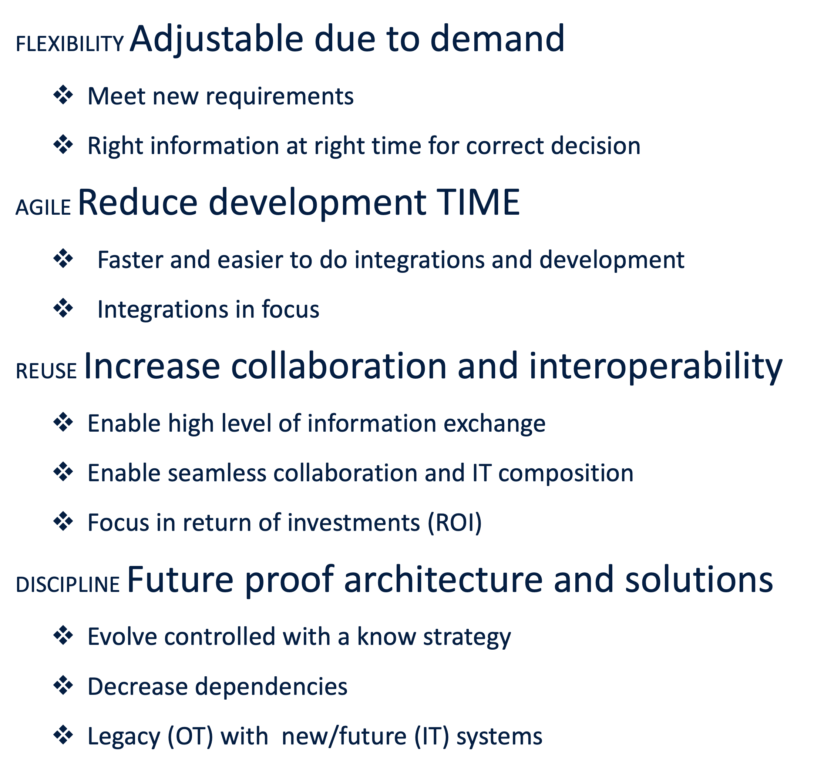
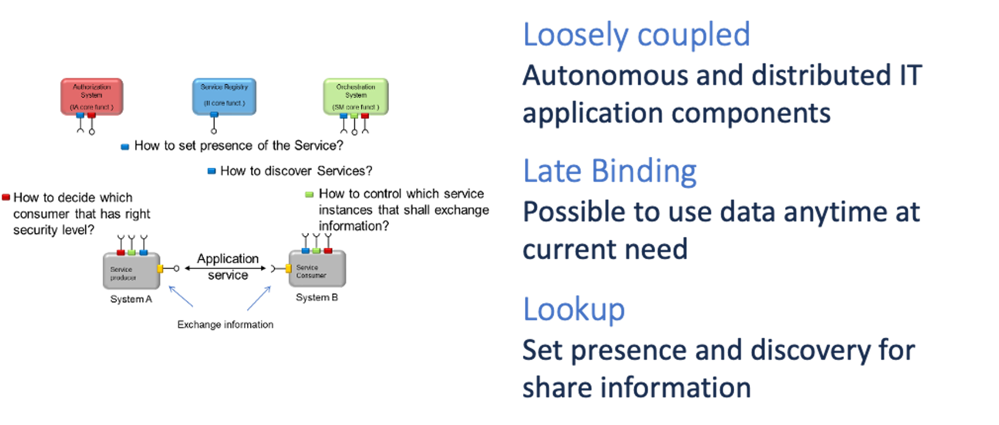
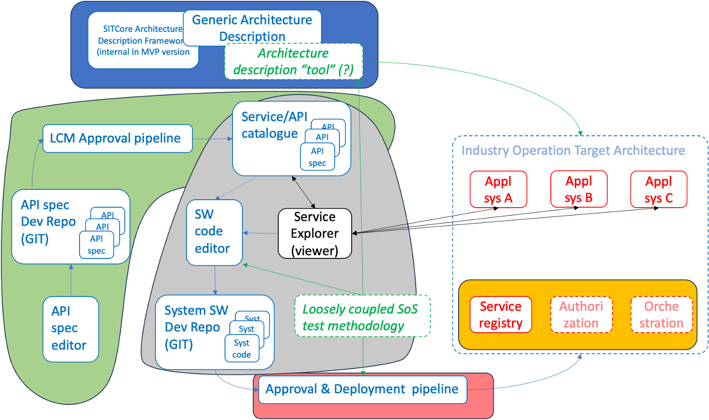

# The architecture and concept

## Story

Companies and organisations is facing rapidly demands and competitiveness challenges on their information systems (applications).

Today’s IT-systems are starting to grow and gets more complex, increase dependencies,  more expensive, less reuse and less control and difficult governance.

We drive the shift towards autonomous forecasts and reports. Collaboration internal and external with partners is seamless and limitless. New ideas and possibilities are validated with good speed and low effort. 

Organisations strive for a modernized digital ecosystem to enable integrations, standard solutions and technologies to embrace flexibility and accelerate business development and capabilities.

Standard solutions and services consume and utilize business data via their API integrations.

The approach to solve those challenges is to construct and manage a common understanding and strategy within the organisation. 

There is a need to have common rules, principles, use of standards, methods and more to achieve successful interoperability between the applications and enable the possibility to achieve collaborative automation.

## Benefits

The SIT Core features and benefits to govern and emphasis API specifications enables following characteristics. The areas with strongest impact are flexibility, agile, reuse and disciplin.

## Extensive experience and knowledge

- Achieving faster results through reuse: 240 hours done in 80!
- 20% cost reduction yearly for complex maintenance and changes!
- Improving delivery precision, reducing complexity, and enhancing IT system quality by a factor of 4!
- Align suppliers with existing integrations reduces allocation and decreases product team involvement by 80%, resulting in annual savings of 1,000,000 SEK!
- Incorporating methods and best practices from reference projects since 2003, supported by a 5 billion SEK investment in R&D!

## Our unique approach

We use API specifications as the controlling tool. Each API specification consist of a unique api identifier, within the yaml-specifications we use x-api-identification and mark each api spec. The API specification is completely loosely coupled, no instances or deployment information. The API specification only mange the service as unique information object, ie. not system-api. Each API specification is implemented by one or more Providers and/or Consumers.

In runtime, each Provider publish and set its prescense within the Service Registry, we use Consule in our example but have also used Bind as a strong solution. The registration is the x-api-identifier value together wieh the specific instance endpoint, complete to establish a connection link for exchange information between consumer(s) and provider(s). The consumer(s) search(discover) wanted information sources (providers) by use the x-api-identifier and fetch the matching instances endpoints.

## Architecture

SERVICE ORIENTED BASED system solutions have decoupled life cycles for each of the components.

It is easier to govern and maintain a modern, long-term and effective integration. This leads to reduced resistance to developing a system solution.

System architecture reduces system solution maintenance costs and maintenance needs can be focused on the necessary features.

The flexibility of service based oriented system solutions allows adjustments to new situations to be done without the need for changing the existing building blocks (components).

With interoperable system solutions, participants can choose which rate to adapt their system to changing needs.

Because the architecture is naturally federative, you can decide how much resources and at what rate you should be interoperable.

In addition, participants can choose which parts of a federal system solution that fits the individual needs.

## Concept

Sinetiq core helps us with our complex integrations, ensures controlled flexibility in an ever-changing IT environment.

Sinetiq Core consist of an integration framework that aims to promote information both as a key asset as well as a key enabler of a modernized digital ecosystem that fosters innovation and facilitates the adoption of new technologies. The framework focus on integrations and provides a common way to do integrations. The goal is to ease governance and maintenance as well as increase reuse and future proof interoperability and flexible solutions that is designed to meet new requirements. Such framework is crucial in supporting an organisation’s journey towards successful digitalization.

The SINETIQ Core approach emphasizes **reuse** and is based on **API First**, ie. strategy around API specifications. It aims to ensure interoperability and reuse by controlling compliance between providers and consumers. 

Our concept emphasize integrations! It establish a unified approach for integrations at your organisation. 
The objective is to simplify governance and maintenance, ensuring future-proof interoperability, enabling reuse and flexible solutions that meet evolving requirements.

Sinetiq Core provides core capabilities that support development and governance methodologies that forms a robust IIoT integration ecosystem for large enterprise organizations with a heterogenous system landscape.

A crucial aspect of applying SINETIQ Core is the management and governance of API specifications, including their life cycle. 

The demonstration covers:
- API specifications approval process
- Software development and/or compliance test process
- Approval and deployment process
- Operational and management process
- 
