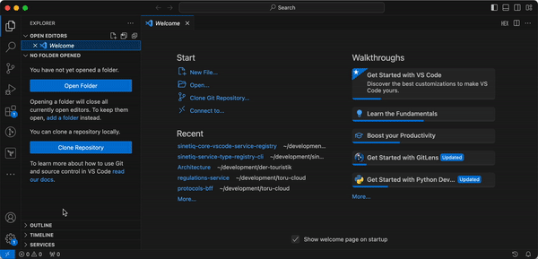

# API specification governance

**This repository provides a comprehensive showcase of how the SINETIQ Framework could be used to successful handle `governance of API specifications` in the complete life cycle chain.**

The covered processes are:
- API **creation** and **approval**; how to create and approve an API specification.
- API **implementation**; how to implement an API specification within a Provider or Consumer component.
- API **deployment**; how to deploy a provider, or consumer, component instance and its API instance(s).
- API **compliancy** test and **verification**; how to verify and test a provider API instance API specification implementation.

<p>&nbsp;</p>

## Getting Started

This section will give an in-depth explanation of components used, the `demonstration setup` and hands-on step-by-step `installation guide`. If preferred you can step to the [Usage](#usage) section directly.

The demonstration showcase also ships with hands-on code `examples` and components, to run, inspect & modify.

### Demonstration Setup

The environment for this demonstration is managed through a client computer and components listed below.

- **API specification registry**: The `Sinetiq API Specification Registry` holds approved and published API specifications and maps them to a unique and immutable identifier

- **CLI tool**: The `api-specification-registry-cli` is used to publish approved API specifications to the API specification reqistry.

- **Pipeline examples**: Download and use the `pipeline example` matching your environment, example Azure, Bitbucket, Github and Jenkins. The pipeline examples uses the `CLI tool`, enabling a complete devops (CI/CD) process, to review, approve and publish the api specification to the _API specification repository_.

- **Service Registry** (Consul from Hashicorp): An active service registry for mapping API specification identifiers and endpoints, used to establishing right connections for wanted information exchange.

- **Service Explorer**: List and view approved API specifications, published within the API specification registry, together with active provider API instances, published within the service registry. The `Sinetiq Service Explorer` is a VSCode extension that helps you find service instances, their specifications and verify the implementaition while developing.

<p>&nbsp;</p>


<p>&nbsp;</p>

### Installation Guide

#### Registry services
This will start the registry components, `API specification registry` and `Service Registry`.

1. Fetch the demonstration github repository.   
    ```sh
    git clone git@github.com:sinetiq/api-specification-governance.git
    ```

2. Change directory to the root git folder where the docker-compose.yml can be found, run the docker command.
    ```sh
    cd api-specification-governance

    docker-compose up
    ```

#### Service explorer
Download and configure Visual Studio Code as your demonstration editor. Install the SINETIQ Service Explorer plugin. Follow the readme at the visual studio code marketplace [https://marketplace.visualstudio.com/items?itemName=Sinetiq.service-explorer](https://marketplace.visualstudio.com/items?itemName=Sinetiq.service-explorer).

Note: Modify the configuration of the `Service Explorer` to use your local registries. 


_Your demonstration environment is now ready._

#### Verify installation

1. Verify the API Specification Registry.  
   Open a webbrowser, use url http://localhost:3333/ to verify up-n-running.

2. Verify Service Registry.  
   Open a webbroser, use url http://localhost:8500/ to verify up-n-running.

3. Verify Service Explorer.  
   Open Visual Code, verify the `Service Explroer` according to user manual.

<p>&nbsp;</p>

## Usage

The steps 1 to 5 will show how to run this demonstration and successfully mange `governance of API specifications` in the complete life cycle chain.


<p>&nbsp;</p>

### Step 1: Create API Specification
Use your preferred editor to create a YAML file for the API specification and store it in your versioning repository (ex. git).

  ```sh
    openapi: 3.0.0
    info:
      description: This is a simple API for accessing temperature sensor data.
      title: Temperature Sensor API HTTP(S)-JSON
      version: 1.0.0
    paths:
      /temperature:
        get:
          responses:
            200:
              content:
                application/json:
                  schema:
                    $ref: '#/components/schemas/TemperatureData'
              description: Temperature data
          summary: Get current temperature data
          x-accepts: application/json
  ```

### Step 2: Publish API Specification
Utilize the approval CLI Tool to publish your API specification to the API specification repository. _Alternative: Use example pipelines matching your environment_.
For test and demonstration purpose use the command line call publish the specification.

  ```sh
   npx @sinetiq/api-specification-registry-cli \
      -g se.sinetiq.example \
      -a temperature-sensor-rest-json \
      -v 1.0.0 \
      -r http://localhost:3333/ \
      --ignore-already-registered \
      --open-api ./demo/temperature-api.yaml
  ```

### Verification
Go to the service registry at localhost:3333 and locate your API specification in the list of published specifications.

### Step 3: Application Development
Develop applications, both providers and consumers, that comply with the API specification. Provider should publish endpoints with the unique API identifier, and consumers should discover and connect to providers using the identifier.

1. Service Provider(s) publish the endpoint, for example serviceType `com.example:temperature-rest-json:1.0.0`.

    ```sh
        ServiceData sd = new ServiceData();
        sd.setHost(serviceProperties.getAdvertisedAddress());
        sd.setPort(serviceProperties.getAdvertisedPort());
        sd.setName(serviceProperties.getServiceName());
        sd.getProperties().put("path", serviceProperties.getBasePath());
        try {
            consulAPI.registerService(sd);
        } catch (NotRegisteredException e) {
            // Handle error state
        }
    ```
    _See complete Provider example code [here](./demo/sinetiq-core-application-temperature-provider/)._

2. Service Consumer(s) discover the information source endpoint to be able to establish connection.

    ```sh
    ServiceType serviceType = new ServiceType("com.example:temperature-rest-json:1.0.0");
    List<ServiceName> apiInstances = consulAPI.getServiceInstances(serviceType);
    System.out.println("Found " + apiInstances.size() + " instaces.");
    for(ServiceName sn : apiInstances) {
      System.out.println("Instance: " + sn.getName());
    }
    ```
    _See complete Consumer example code [here](./demo/sinetiq-core-application-temperature-consumer/)._

### Step 4: Launch provider
Launch your application components with their API implementation to operating instances. _The demostration Provider and Consumer can be found within the demo-folder._

  ```sh
  cd demo
  docker-compose up
  ```

### Step 5: Verification with Service Explorer
Utilize Visual Studio Code and the Service Explorer to list, verify, and test the existing Providers and their API instances.
  
  
  1. Explore API specifications within the `API specification registry`
  2. Explore the `API instance registry`
  3. Choose one API instance and test the provider API implementation
     a. Send a request and examine the response

<p>&nbsp;</p>

## How to Build, etc.

See the specific demo README-files for details about modifying and build the provider and consume example code.
You can find the provider and consumer within the demo folder.

## Reach out

Please reach out by contact us throught email [Contact Us](mailto:info@sinetiq.se) for details, discussion, report an bug, request a feature, schedule a demonstration, etc.

Complete product documentation can be achivied at hour home page [Product Documentation](http://www.sinetiq.se) by comply to our SINETIQ Framework customer form.
