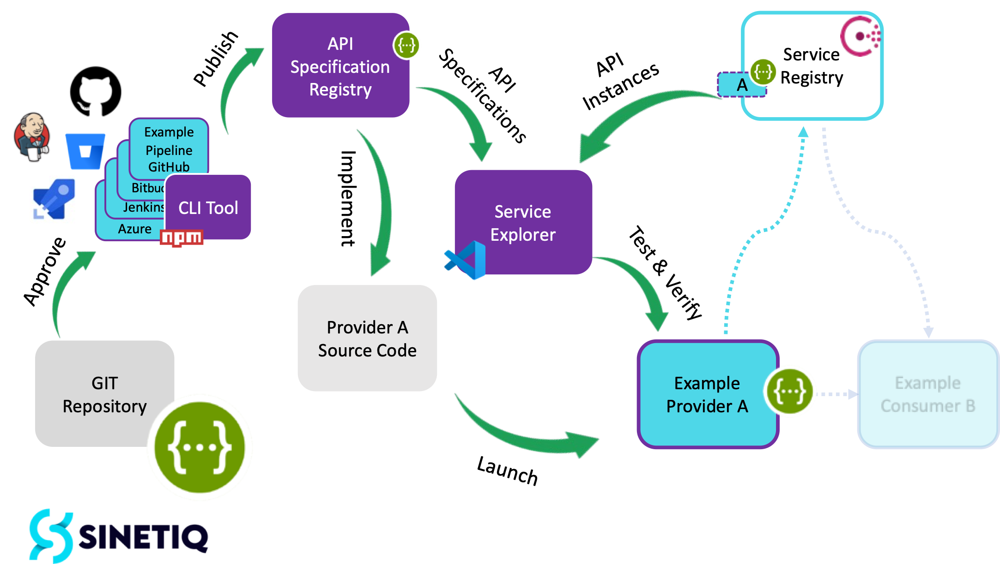
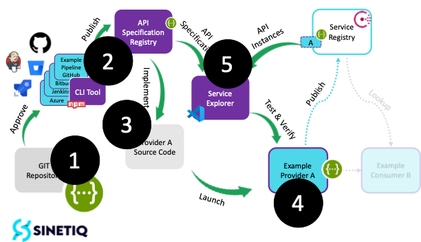

# API specification governance

**This repository provides a comprehensive showcase of how the SINETIQ Framework could be used to successful handle `governance of API specifications` in the complete life cycle chain.**

The covered processes are:
- API **creation** and **approval**; how to create and approve an API specification.
- API **implementation**; how to implement an API specification within a Provider or Consumer component.
- API **deployment**; how to deploy a provider, or consumer, component instance and its API instance(s).
- API **compliancy** test and **verification**; how to verify and test a provider API instance API specification implementation.

_Sinetiq Framwork provides core capabilities that support development and governance methodologies that forms a robust integration ecosystem for small, medium and large enterprise organizations with a heterogenous system landscape._

## Getting Started

This section will give an in-depth explanation of components used, the `demonstration setup` and hands-on step-by-step `installation guide`.

The demonstration showcase also ships with hands-on code `examples` and components, to run, inspect & modify.


### Demonstration Setup

The environment for this demonstration is managed through a client computer and components listed below.

- **API specification registry**: The `Sinetiq API Specification Registry` consist of published and approved api specifications with its generated unique identifier.

- **CLI tool**: The `api-specification-registry-cli` is used to publish approved API specifications to the API specification reqistry.

- **Pipeline examples**: Download and use the `pipeline example` matching your environment, example Azure, Bitbucket, Github and Jenkins. The pipeline examples uses the `CLI tool`, enabling a complete devops (CI/CD) process, to review, approve and publish the api specification to the _API specification repository_.

- **Service Registry** (Consul from Hashicorp): An active service registry for mapping API specification identifiers and endpoints, used to establishing right connections for wanted information exchange.

- **Service Explorer**: List and view approved API specifications, published within the API specification registry, together with active provider API instances, published within the service registry. The `Sinetiq Service Explorer` is a VSCode extension that helps you find service instances and their specifications while developing.

<p>&nbsp;</p>
<div style="text-align:center">

</div>
  
<p>&nbsp;</p>

### Installation Guide

#### Registry services
This will start the registry components, `API specification registry` and `Service Registry`.

1. Fetch the demonstration github repository.   
```sh
git clone git@github.com:Sinetiq/api-specification-governance.git
```

2. Change directory to the root git folder where the docker-compose.yml can be found, run the docker command.
```sh
cd api-specification-governance

docker-compose up
```

_You can stop your registry services with CTRL-C._

#### Service explorer
Download and configure Visual Studio Code as your demonstration editor. Install the SINETIQ Service Explorer plugin. Follow the readme at the visual studio code marketplace [https://marketplace.visualstudio.com/items?itemName=Sinetiq.service-explore](https://marketplace.visualstudio.com/items?itemName=Sinetiq.service-explore).

#### CLI tool: Manual run (not devops pipeline)

1. Download CLI tool component from [https://www.npmjs.com/package/@sinetiq/api-specification-registry-cli](https://www.npmjs.com/package/@sinetiq/api-specification-registry-cli). Configure the CLI for your GIT repository containing API specifications (YAML files).
   
```sh
npm i @sinetiq/api-specification-registry-cli
```

#### CLI tool: Automation, devops (CI/CD) pipeline

1. Use `pipeline example` matching your environment.

2. Create the API specification and version control it in your git-repo, attached to your created pipeline.

3. Create a Pull Request/Merge Request, review, approve and merge the API specification, initiate the pipeline.


_Your demonstration environment is now ready._

#### Verify installation

1. Verify the API Specification Registry.  
   Open a webbrowser, use url http://localhost:3333/ to verify up-n-running.

2. Verify Service Registry.  
   Open a webbroser, use url http://localhost:8500/ to verify up-n-running.

3. Verify Service Explorer.  
   Open Visual Code, verify the `Service Explroer` accroding to user manual.

4. Verify CLI-installed.
   ```sh
   npm -v @sinetiq/api-specification-registry-cli
   ```

<p>&nbsp;</p>

## Usage

The steps 1 to 5 will show how to run this demonstration and successfully mange `governance of API specifications` in the complete life cycle chain.

<div style="text-align:center">

</div>
<p>&nbsp;</p>

### Step 1: Create API Specification
Use your preferred editor to create a YAML file for the API specification and store it in your versioning repository (ex. git). Ensure each specification has an API identifier (`x-api-identifier`) with a unique name. _The API specifications will be loosely coupled, no server part and only one specific information object (resource)._ 

  ```sh
    openapi: 3.0.0
    info:
      description: This is a simple API for accessing temperature sensor data.
      title: Temperature Sensor API HTTP(S)-JSON
      version: 1.0.0
      x-service-identifier: temperature-sensor
    paths:
      /temperature:
        get:
          responses:
            200:
              content:
                application/json:
                  schema:
                    $ref: '#/components/schemas/TemperatureData'
              description: Temperature data
          summary: Get current temperature data
          x-accepts: application/json
  ```

### Step 2: Publish API Specification
Utilize the approval CLI Tool to publish your API specification to the API specification repository. _Alternative: Use example pipelines matching your environment_.
For test and deemonstration purpose use the command line call publish the specification.

  ```sh
  npx @sinetiq/api-specification-registry-cli --glob **/api-specification.json --ignore-already-registered --file api-spec.yml
  ```

### Verification
Check the API specification registry UI to confirm the correct approval and deployment of your API specifications.

1. Start a web browser
2. Type in `api-registry-url:port/asdasd`
3. Your spec is now published within the API specification registry.

### Step 3: Application Development
Develop applications, both providers and consumers, that comply with the API specification. Provider should publish endpoints with the unique API identifier, and consumers should discover and connect to providers using the identifier.

1. Service Provider(s) publish the endpoint, for example serviceType `temperature-service-rest-json`.

    ```sh
    ServiceData sd = new ServiceData();
    sd.setHost(host);
    sd.setPort(port);
    String serviceName = environment.getProperty("service.name");
    String serviceType = environment.getProperty("service.type");
    sd.setName(new ServiceName(serviceName, new ServiceType(serviceType)));
    String basePath = environment.getProperty("service.basePath");
    sd.getProperties().put("path", basePath);
    consulAPI.registerService(sd);
    ```
    _See complete Provider example code here._

2. Service Consumer(s) discover the information source endpoint to be able to establish connection.

    ```sh
    ServiceType serviceType = new ServiceType("temperature-sensor-rest-json");
    List<ServiceName> apiInstances = consulAPI.getServiceInstances(serviceType);
    System.out.println("Found " + apiInstances.size() + " instaces.");
    for(ServiceName sn : apiInstances) {
      System.out.println("Instance: " + sn.getName());
    }
    ```
    _See complete Consumer example code here._

### Step 4: Deploy
Launch your application components with their API implementation to operating instances. _The demostration Provider and Consumer can be found within the demo-folder._

  ```sh
  cd demo
  docker-compose up
  ```

### Step 5: Verification with Service Explorer
Utilize Visual Studio Code and the Service Explorer to list, verify, and test the existing Providers and their API instances.
  
  
  1. Explore API specifications within the `API specification registry`
  2. Explore the `API instance registry`
  3. Choose one API instance and test the provider API implementation
     a. Send a request a examin the response

<p>&nbsp;</p>

## How to Build, etc.

See the specific demo README-files for details about modifying and build the provider and consume example code.
You can find the provider and consumer within the demo folder.

## Reach out

Please reach out by contact us throught email [Contact Us](mailto:info@sinetiq.se) for details, discussion, report an bug, request a feature, schedule a demonstration, etc.

Complete product documentation can be achivied at hour home page [Product Documentation](www.sinetiq.se) by comply to our SINETIQ Framework customer form.
